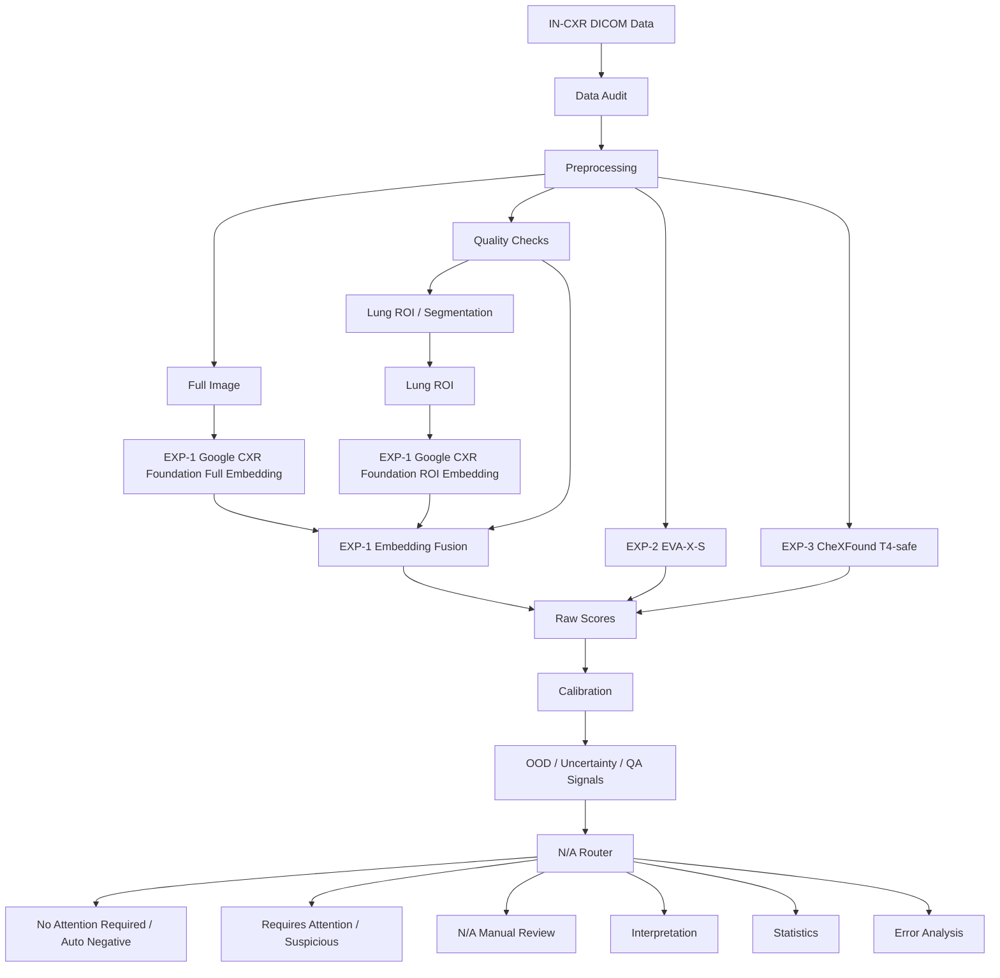
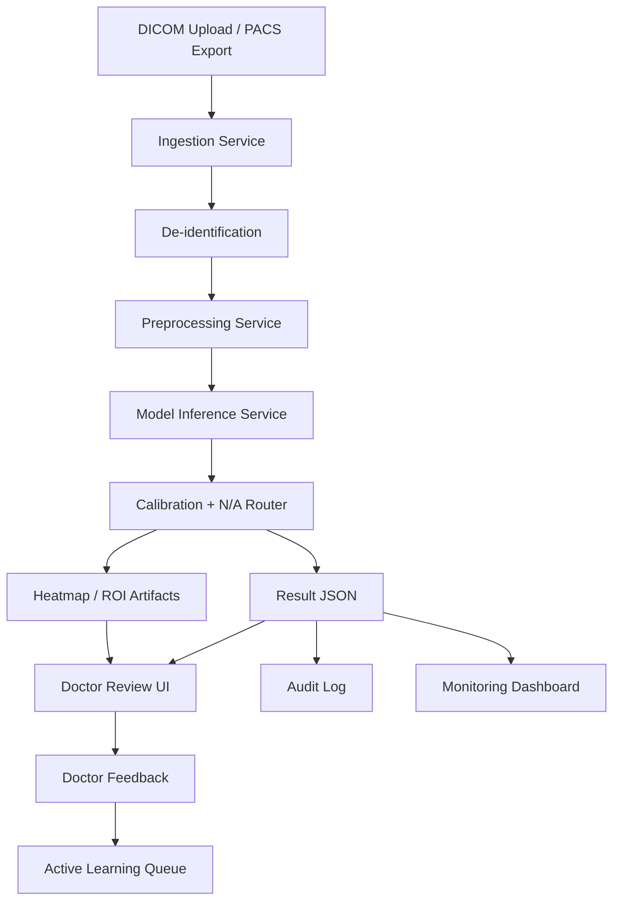

# Технический план MVP: классификация флюорографии / CXR с safety-first маршрутизацией

**Версия:** 0.7  
**Дата:** 2026-06-23  
**Формат:** один рабочий notebook + последующая разработка backend  
**Цель версии:** сделать план понятным и для ML-команды, и для продуктовой команды; адаптировать критический путь под доступное железо Tesla T4 16GB; явно зафиксировать checkpointing, артефакты, границы preprocessing/postprocessing и приоритеты экспериментов.

---

## 0. Executive summary для продуктовой команды

Мы строим не «автоматического врача», а **систему маршрутизации флюорографических / рентгенологических исследований грудной клетки**.

Система должна выдавать одно из трёх решений:

```text
1. no_attention_required / auto_negative
   Модель уверенно считает исследование нормальным / не требующим внимания.
   Такие случаи потенциально можно разгружать автоматически.

2. requires_attention / abnormal / suspicious
   Модель видит подозрение на проблему.
   Случай должен попасть врачу с подсказкой и объяснением.

3. N/A / manual_review
   Модель не должна принимать автоматическое решение:
   плохое качество, неизвестный домен, низкая уверенность, противоречивые признаки.
```

Главный принцип:

```text
Модель не обязана отвечать всегда.
Модель обязана безопасно не отвечать, когда уверенности недостаточно.
```

Главная метрика MVP:

```text
NPV >= 99–99.5% на зоне no_attention_required / auto_negative
```

То есть мы не обещаем «99% accuracy на всём потоке». Мы хотим доказать, что можем **безопасно выделять часть исследований, которые не требуют внимания**, а все подозрительные и сомнительные случаи отправлять врачу.

---

## 0.1. Словарь для продуктовой команды

В документе специально оставлены английские ML/engineering-термины, потому что
именно они будут использоваться в коде, статьях, model cards и репозиториях
моделей. Ниже — короткий перевод смысла на русский.

```text
Research notebook
  Исследовательский ноутбук: один воспроизводимый файл, где мы загружаем данные,
  готовим снимки, запускаем модели, считаем метрики и сохраняем артефакты.

Preprocessing
  Предобработка снимка до модели: чтение DICOM/JPEG, исправление яркости,
  нормализация, resize/padding, проверка качества и подготовка ROI.

DICOM / PACS
  DICOM — медицинский формат снимков и metadata.
  PACS — больничная система хранения и передачи медицинских изображений.

Postprocessing
  Обработка ответа модели после inference: calibration, пороги, N/A-router,
  итоговый route и причины решения.

Route
  Итоговый маршрут исследования: no_attention_required, requires_attention
  или N/A/manual_review.

Inference
  Прогон уже обученной модели на снимке. В first branch тяжёлые encoders в основном
  используются именно для inference/embedding extraction, а не для полного обучения.

Embedding
  Числовое представление снимка. Модель превращает изображение в вектор признаков,
  а лёгкая classification head уже учится решать нашу задачу.

ROI / lung ROI
  Region of Interest / область интереса. Здесь это crop лёгких: отдельно смотрим
  весь снимок и область лёгких, чтобы снизить влияние рамок, текста и артефактов.

Classification head
  Небольшой классификатор поверх embeddings/frozen encoder. Это дешёвая часть,
  которую мы реально можем обучать на Tesla T4.

Frozen encoder
  “Замороженный” encoder: большая модель не дообучается, а только извлекает
  признаки. Это экономит GPU-память и снижает риск переобучения.

LoRA / adapters
  Лёгкий способ немного адаптировать большую модель без полного fine-tune.
  В first branch это только controlled extension, если head-only недообучается.

Calibration
  Калибровка вероятностей. Нужно, чтобы score модели был ближе к реальному риску,
  а не просто красивому числу.

N/A-router
  Правило безопасного отказа: если качество плохое, уверенность низкая или случай
  похож на неизвестный домен, система отдаёт manual_review вместо уверенного ответа.

OOD
  Out-of-distribution: снимок не похож на данные, на которых система валидировалась.
  Такие случаи нельзя автоматически пропускать.

Risk-coverage curve
  График компромисса: какую долю исследований можно auto-clear
  (автоматически отнести к no_attention_required) и какой риск ошибок
  остаётся на этой доле.

NPV / PPV / Sensitivity / Specificity
  NPV: насколько безопасна зона “не требует внимания”.
  PPV: насколько часто сигнал “требует внимания” действительно подтверждается.
  Sensitivity: насколько хорошо ловим случаи, требующие внимания.
  Specificity: насколько хорошо не перегружаем врачей лишними подозрениями.

AUROC / AUPRC
  Общие ML-метрики качества ранжирования. Полезны, но не главные для продукта:
  решение MVP принимается по NPV@coverage, FN per 1000 и N/A rate.

Checkpointing
  Сохранение промежуточных результатов, чтобы Colab-сессия могла оборваться,
  а работа не начиналась с нуля.

Quantization
  Сжатие лучшей модели для более лёгкого inference. Делается только после выбора
  модели и с повторной проверкой calibration/thresholds.

VLM
  Vision-language model. Позже может помогать с retrieval, текстом и объяснениями,
  но не должна сама ставить диагноз в MVP.
```

---

## 1. Упрощённая структура проекта

Проект делится на две большие части.

```text
Часть 1. Research notebook
  Один notebook, в котором проверяется вся ML-логика:
  - данные;
  - preprocessing;
  - модели;
  - postprocessing;
  - calibration;
  - N/A-router;
  - интерпретация;
  - статистика;
  - анализ ошибок.

Часть 2. Product / backend
  После доказательства качества в notebook:
  - API;
  - обработка DICOM;
  - inference service;
  - хранение результатов;
  - простая review-страница для врача;
  - логирование;
  - подготовка к пилоту.
```

VLM / vision-language часть не является ядром первого MVP. Она выносится в третий приоритет и используется позже для retrieval, объяснений, проверки image-text consistency и работы с заключениями.

---

## 2. Один основной notebook

Вместо множества notebooks фиксируем один основной файл:

```text
fluoro_mvp_single_notebook.ipynb
```

Он должен быть не просто exploratory notebook, а воспроизводимый research-pipeline с секциями.

### Структура notebook

```text
0. Project config
1. Problem definition and label ontology
2. Dataset loading
3. Data audit
4. Preprocessing
5. Quality checks
6. Lung ROI preparation
7. Experiment 1: Google CXR Foundation full/ROI embedding fusion
8. Experiment 2: EVA-X-S frozen/head + LoRA controlled extension
9. Experiment 3: CheXFound frozen embeddings/inference reference
10. Calibration
11. Selective N/A-router
12. Interpretation and visualization
13. Statistics and validation report
14. Error analysis
15. Checkpointing and artifact saving
16. Quantization candidate and inference benchmark
17. Demo inference on one study
18. Export artifacts for backend phase
```

Каждая секция должна иметь:

```text
- цель;
- входные данные;
- выходные данные;
- код;
- таблицу/график;
- краткий вывод.
```

Пояснение для продуктовой команды:

```text
Notebook здесь не “черновик ради экспериментов”, а полный прототип системы.
Он должен показать весь путь одного исследования:
  данные -> обработка снимка -> модель -> безопасное решение -> объяснение -> отчёт.

Если notebook воспроизводимо проходит этот путь и сохраняет артефакты, backend
потом просто переносит проверенную логику в сервис.
```

---

## 3. Датасеты first branch

## 3.1. Primary first-branch dataset: IN-CXR

Для первого исследовательского notebook выбираем **один основной открытый набор**:
`IN-CXR`.

Почему именно IN-CXR:

```text
IN-CXR:
  adult PA chest radiography из national TB prevalence survey;
  DICOM;
  normal / abnormal groups;
  ближе всего к screening-задаче no_attention_required / requires_attention.
```

Пояснение для продуктовой команды:

```text
IN-CXR — это не “идеальная российская флюорография”, но это лучший найденный
открытый proxy под нашу задачу: массовый скрининг грудной клетки у взрослых,
где надо отделить нормальные исследования от исследований, требующих внимания.

Мы честно называем его:
  FLG-like / screening-like chest radiography proxy.

То есть:
  на IN-CXR мы строим и проверяем открытый исследовательский pipeline;
  финальный claim “работает на флюорографии” позже требует небольшой реальной
  FLG validation, например 300–1000 исследований.
```

Рабочая постановка на IN-CXR:

```text
normal    -> no_attention_required
abnormal  -> requires_attention
N/A       -> не label датасета, а решение postprocessing/router-а
```

Важное ограничение:

```text
IN-CXR abnormal означает abnormal в контексте screening chest radiography /
TB prevalence survey, а не полную разметку всех возможных патологий грудной
клетки.

Поэтому на IN-CXR мы доказываем качество triage-пайплайна и способность
отделять normal от attention_required proxy. Мы не делаем финальный claim,
что модель уже покрывает весь спектр реальной флюорографии без локальной
валидации.
```

Как используем IN-CXR:

```text
1. Загружаем DICOM.
2. Проверяем projection/view и качество.
3. Строим patient/study-level index, насколько позволяет metadata.
4. Делаем split:
   train / calibration / validation / final_test.
5. Calibration и threshold search делаем только на calibration/validation,
   final_test держим закрытым до финальной оценки.
6. Боевой default для Colab/T4: subset до 5000 IN-CXR studies.
   Если доступна более крупная среда, можно расширять, но first run фиксируем на 5000.
```

Colab-free data access update:

```text
Official IN-CXR:
  original source = NIRT registration portal;
  original format = DICOM;
  лучший вариант для provenance/audit, но не всегда удобен для автоматической загрузки в notebook.

Kaggle IN-CXR PNG mirror:
  arjav007/in-cxr-dataset-png;
  примерно 380 MB compressed;
  структура Normal / AbNormal;
  уже preprocessed PNG 224x224;
  подходит для простого Colab notebook download и first screening-quality run.

Ограничение:
  Kaggle mirror не равен original DICOM.
  Он удобен для Colab-free эксперимента, но final claim лучше подтверждать
  на original DICOM или локальной флюорографии.
```

Почему нам не нужно искусственно искать 65k+ исследований:

```text
Для embedding-first pipeline и frozen encoders достаточно существенно меньшего
набора, если данные ближе к задаче и labels достаточно чистые.
Качество данных и соответствие screening-flow важнее, чем абстрактный размер.
```

## 3.2. Второй dataset-track: VinDr-CXR для interpretation/localization sanity

В notebook добавляем **VinDr-CXR** как второй независимый трек, а не как замену
IN-CXR.

```text
VinDr-CXR:
  DICOM chest X-rays;
  image-level normal/abnormal/finding labels;
  radiologist bounding boxes;
  подходит для проверки, смотрит ли модель на медицински осмысленные области.
```

Пояснение для продуктовой команды:

```text
IN-CXR отвечает на вопрос:
  насколько хорошо pipeline работает как screening triage:
  normal -> no_attention_required,
  abnormal -> requires_attention / N/A.

VinDr-CXR отвечает на другой вопрос:
  если модель считает снимок подозрительным, совпадает ли её visual explanation
  с областями, которые радиологи отметили bounding boxes.

Это два разных типа доказательств:
  IN-CXR -> качество маршрутизации в screening-like задаче;
  VinDr-CXR -> доверие к интерпретации и spatial sanity check.
```

Как используем VinDr-CXR в first notebook:

```text
1. Загружаем VinDr-CXR из PhysioNet или Kaggle competition mirror.
2. Берём subset до 5000 studies, чтобы уложиться в Colab/T4.
   Для Colab free / 12GB RAM основной режим — PNG512 subset:
     скачиваем train.csv;
     скачиваем selected train/<image_id>.png из compact PNG mirror;
     скачиваем images.csv metadata с original DICOM Rows/Columns;
     используем metadata для корректного bbox scaling.
   Official DICOM используем для малого audit/provenance subset, не для 5000-study free-Colab run.
   Full competition archive не скачиваем:
     сначала скачиваем train.csv,
     затем потоково скачиваем только выбранные images.
3. Не смешиваем train/test VinDr с IN-CXR на первой итерации.
4. Строим отдельные splits:
   train / calibration / validation / final_test.
5. Запускаем две основные модели:
   EXP-1 Google CXR Foundation full/ROI embeddings + calibrated head;
   EXP-2 EVA-X-S frozen features + calibrated head.
6. Сравниваем модели по тем же safety-метрикам:
   AUROC, AUPRC, NPV@coverage, FN per 1000, N/A rate.
7. Для лучшей модели строим bbox-aware interpretation:
   heatmap overlays,
   energy_inside_bbox,
   pointing_game_hit,
   IoU/top-k heatmap sanity.
```

Важное ограничение:

```text
VinDr-CXR не доказывает финальное качество на флюорографии.
Он нужен, чтобы проверить интерпретируемость: модель не просто угадывает label,
а реагирует на области, похожие на реальные radiologist annotations.

IN-CXR heatmap без lesion masks/bounding boxes показывает attribution, но не
validated localization. VinDr-CXR закрывает именно этот пробел.
```

Важное техническое ограничение VinDr/VinBigData mirrors:

```text
Official DICOM:
  bbox coordinates находятся в том же pixel space, что и исходный DICOM.
  Это предпочтительный вариант для bbox-aware interpretation.

Public resized PNG mirrors:
  image уже может быть 256/512/1024 px,
  а bbox coordinates в train.csv часто остаются от исходного DICOM.

Чтобы heatmap/bbox interpretation была корректной:
  рядом с train.csv должен быть metadata файл:
    images.csv / train_meta.csv / metadata.csv / dicom_metadata.csv
  с исходными Rows и Columns.

Notebook умеет читать такой metadata файл и масштабировать bbox.
Если resized PNG используется без original Rows/Columns:
  classification можно запускать,
  bbox-based interpretation считаем невалидной.
```

Итоговая логика двух датасетов:

```text
IN-CXR:
  primary quality/screening track;
  проверяет, как модель реагирует в скрининговой постановке.

VinDr-CXR:
  interpretation/localization track;
  проверяет, насколько объяснения модели совпадают с radiologist boxes.

Первый запуск:
  обучаем и оцениваем независимо;
  не смешиваем датасеты;
  сравниваем выводы по двум разным claims.
```

## 3.3. Датасеты вне first branch

Эти наборы не являются основными в первой реализации notebook, но остаются
полезными для fallback, sanity check или поздней проверки.

```text
1. CheXpert frontal 5–10k subset
   большой и удобный CXR benchmark;
   хороший для preflight/comparison;
   хуже совпадает со screening-флюорографией, чем IN-CXR.

2. NIH ChestX-ray14 sample/full
   можно использовать как быстрый 5–10k public subset;
   labels weak/NLP-derived, поэтому не главный источник safety-claims.

3. MOSMED XR Chest Pathologies
   небольшой Moscow DICOM CXR dataset, около 179 исследований;
   полезен как smoke/external sanity check, но слишком мал для primary training.

4. MIMIC-CXR / MIMIC-CXR-JPG
   большой CXR/report corpus;
   нужен позже, если появится report mining или domain pretraining.
```

Не использовать как primary:

```text
Lungs Disease Dataset (4 types) / IEEE DataPort mirror
  -> mixed Kaggle JPEG dataset;
  -> классы COVID / pneumonia / TB / normal;
  -> аугментация уже включена в датасет;
  -> нет patient-level split, DICOM metadata и screening provenance;
  -> не является флюорографией;
  -> можно использовать только как toy/smoke ImageFolder loading test.
```

## 3.4. Почему CheXpert больше не primary

CheXpert остаётся важным public CXR benchmark, но не является главным набором
для нашей first branch.

```text
CheXpert:
  large hospital chest X-ray dataset;
  есть uncertainty labels;
  удобен для сравнения моделей;
  но это не screening-flow и не флюорография.

Поэтому:
  CheXpert не удаляем из плана;
  CheXpert не используем как основной first-branch dataset;
  CheXpert оставляем как fallback/comparison later.

Если позже появится локальная флюорография:
  используем её для target-domain validation/recalibration;
  не смешиваем её с IN-CXR final_test.
```

---

## 4. Label ontology: как формулируем задачу

## 4.1. Основная triage-задача

Для MVP главная задача — не детальная диагностика всех заболеваний, а безопасная маршрутизация.

```text
no_attention_required / auto_negative
requires_attention / abnormal / suspicious
N/A / manual_review / cannot_decide
```

Но `N/A` — это не медицинский класс. Это **решение системы не автоматизировать случай**.

## 4.2. Binary target для классификатора

Для обучения классификатора:

```text
no_attention_required = No Finding / нет клинически значимой патологии
requires_attention = есть хотя бы один clinically relevant positive finding
```

Для IN-CXR first branch:

```text
normal group    -> y_attention = 0 -> no_attention_required
abnormal group  -> y_attention = 1 -> requires_attention
```

Пояснение для продуктовой команды:

```text
Мы не просим модель сразу назвать точную болезнь.
На первом уровне модель должна ответить на более безопасный вопрос:
  “можно ли это исследование не отправлять врачу прямо сейчас?”
или
  “здесь есть признаки, из-за которых исследование требует внимания?”
```

Пример агрегации CheXpert labels, если CheXpert используется позже как fallback:

```text
requires_attention = any positive among:
  Atelectasis
  Cardiomegaly
  Consolidation
  Edema
  Enlarged Cardiomediastinum
  Fracture
  Lung Lesion
  Lung Opacity
  Pleural Effusion
  Pleural Other
  Pneumonia
  Pneumothorax
  Support Devices — опционально исключить из medical abnormal target
```

Важно отдельно решить, что делать с `Support Devices`: для флюорографии это может быть не релевантно, поэтому в MVP лучше исключить этот label из abnormal target или держать отдельным техническим признаком.

Внутреннее имя target в notebook:

```text
y_attention = 1  -> requires_attention
y_attention = 0  -> no_attention_required
route = N/A      -> постпроцессинг/router, а не supervised disease class
```

## 4.3. Multi-label target

Для IN-CXR first branch **multi-label head не является обязательным**, потому что
основная доступная разметка для критического пути — `normal / abnormal`.
Обязательная supervised-задача в первом notebook — `y_attention`.

Multi-label head добавляем только в одном из случаев:

```text
1. выбран fallback/later dataset с детальными finding labels;
2. появились локальные врачебные labels;
3. используем VLM/report parser позже для weak labels, но не для final safety claim.
```

Кандидатный набор labels для позднего multi-label режима:

```text
- opacity / infiltrate
- nodule_or_mass / lung lesion
- pleural_effusion
- pneumothorax
- cardiomegaly
- fibrosis_or_post_tb_changes, если есть локальная разметка
- other_suspicious_abnormality, если есть локальная врачебная разметка
```

Пояснение для продуктовой команды:

```text
В первой версии мы не обещаем, что модель точно назовёт конкретную патологию.
Главное решение: требует ли исследование внимания или может быть безопасно
отложено как no_attention_required.

Детальные suspected findings — полезная подсказка для врача, но это позднее
расширение. MVP-победа считается по triage-метрикам.
```

---

## 5. Три приоритетных эксперимента с моделями

В критическом пути оставляем только три эксперимента.

```text
EXP-1: Google CXR Foundation full/ROI pooled embeddings + calibrated shallow fusion head
EXP-2: EVA-X-S frozen encoder + head, then LoRA/adapters if stable
EXP-3: CheXFound frozen embeddings/inference + lightweight head
```

У каждого эксперимента есть **first branch**. Именно её реализуем первой в notebook.
Остальные варианты не удаляются из проекта, но уходят во второй или третий приоритет.

### First-branch contract

```text
First branch должна одновременно:
1. помещаться в Google Colab на Tesla T4 16GB;
2. давать сильный старт по quality без full fine-tune тяжёлых encoders;
3. сохранять всю safety-first логику:
   calibration, threshold search, N/A-router, error analysis;
4. быть воспроизводимой после обрыва Colab session через artifact cache;
5. иметь один основной путь и максимум одно controlled extension.
```

Таблица first branches:

```text
EXP-1 first:
  Google CXR Foundation embeddings для full image и lung ROI
  -> token pooling / bottleneck
  -> elastic-net logistic regression + calibrated shallow MLP as controlled extension

EXP-2 first:
  EVA-X-S frozen encoder
  -> train multi-task classification head
  -> LoRA/adapters на последних блоках только если head-only стабилен

EXP-3 first:
  CheXFound frozen encoder / available checkpoint inference
  -> embeddings или pretrained GLoRI inference если доступно
  -> lightweight calibrated head
```

Пояснение для продуктовой команды:

```text
Мы не перебираем десятки моделей.
Мы берём три сильные роли:
  EXP-1 — главный практичный pipeline на embeddings;
  EXP-2 — компактная foundation-модель, которую можно слегка адаптировать;
  EXP-3 — тяжёлый strong reference, который используем безопасно через frozen inference.

Это нужно, чтобы получить сильное решение без риска, что Colab/T4 развалится
на полном обучении большой модели.
```

### Ограничение по железу

Критический путь должен работать на доступном железе:

```text
Основная GPU: Tesla T4 16GB
Дополнительно: бесплатный Google Colab TPU, но только как опциональный ресурс
```

Поэтому в MVP запрещаем тяжёлые режимы как обязательные:

```text
- full fine-tune больших ViT/backbone;
- большие batch sizes;
- обучение нескольких тяжёлых моделей одновременно;
- эксперименты, которые требуют A100/80GB как обязательное условие.
```

Основная стратегия:

```text
1. Извлекать embeddings и кэшировать их.
2. Обучать лёгкие heads/classifiers.
3. Использовать mixed precision.
4. Использовать gradient accumulation.
5. Сохранять checkpoints и промежуточные артефакты после каждого тяжёлого шага.
```

---

## 5.1. EXP-1 — Google CXR Foundation full image + lung ROI embedding fusion

### Роль

Самый практичный и T4-safe эксперимент в критическом пути. Это главный архитектурный эксперимент MVP, потому что он проверяет нашу сильную продуктовую гипотезу без тяжёлого full fine-tune.

### Что проверяем

```text
Если взять сильные CXR embeddings отдельно для полного снимка и для lung ROI,
а затем объединить их с QA/metadata features,
можно получить более устойчивый triage-classifier и лучшее N/A-routing качество.
```

### Почему выбран

Google CXR Foundation — embedding-oriented модель для chest X-ray. Она выдаёт ELIXR image embeddings и contrastive image-text embeddings. Это хорошо подходит для MVP, потому что downstream classifier можно обучать с меньшим количеством данных и compute, а embeddings можно использовать для OOD/retrieval.

### Архитектура

```text
Full image
  -> Google CXR Foundation encoder
  -> full_embedding

Lung ROI image
  -> Google CXR Foundation encoder
  -> roi_embedding

QA / metadata features
  -> small tabular vector

[full_embedding, roi_embedding, qa_features]
  -> calibrated fusion classifier
  -> calibration
  -> N/A-router
```

### First branch EXP-1

В первом notebook реализуем один основной путь и одно controlled extension.

```text
EXP-1-FIRST-A:
  full image -> Google CXR Foundation ELIXR embeddings
  lung ROI   -> Google CXR Foundation ELIXR embeddings
  embeddings -> token pooling / bottleneck
  qa features + roi_missing_flag
  -> elastic-net logistic regression
  -> calibration
  -> N/A-router

EXP-1-FIRST-B:
  тот же feature set
  -> small MLP with bottleneck + dropout
  -> использовать только если logistic regression явно underfits
```

Пояснение для продуктовой команды:

```text
EXP-1 — это главный практичный путь.
Мы не “учим огромную модель с нуля”, а берём сильную медицинскую CXR-модель,
получаем от неё признаки снимка и обучаем поверх них маленький, контролируемый
классификатор. Так мы экономим GPU, уменьшаем риск переобучения и быстрее
получаем проверяемый результат.
```

### Классификационная голова для high-dimensional embeddings

Google CXR Foundation может выдавать token-level embeddings. Если бездумно
склеить `full_embedding` и `roi_embedding`, размерность быстро станет слишком
большой для ограниченного IN-CXR split и classifier начнёт учить шум,
сканер, рамки, текстовые маркеры или особенности preprocessing.

Поэтому запрещаем прямой baseline вида:

```text
flatten(full_tokens) + flatten(roi_tokens) -> большой MLP
```

как основной вариант. Его можно оставить только как diagnostic experiment на
большом train-set и с жёсткой регуляризацией.

Основная T4-safe схема first branch:

```text
full token embeddings
  -> mean pooling + max pooling или attention pooling
  -> LayerNorm
  -> bottleneck projection 256/512

roi token embeddings
  -> mean pooling + max pooling или attention pooling
  -> LayerNorm
  -> bottleneck projection 256/512

qa/metadata features
  -> StandardScaler
  -> small projection 16/32

[full_z, roi_z, qa_z, roi_missing_flag]
  -> elastic-net logistic regression или small bottleneck MLP
  -> p_requires_attention
  -> optional p_findings только если есть detailed finding labels
```

Обязательные anti-overfit меры:

```text
1. Fit scaler/PCA/calibrator только на train/calibration split, не на test.
2. Начинать с L2/elastic-net logistic regression.
3. Для MLP использовать маленький bottleneck, dropout, weight decay, early stopping.
4. Отдельно сравнить:
   - full only;
   - ROI only;
   - full + ROI concat after pooling;
   - full + ROI + QA final first branch.
5. Если используется PCA/IncrementalPCA:
   - fit только на train;
   - сохранить PCA artifact;
   - тестировать 256/512/1024 dims per stream.
6. Хранить embeddings можно в float16, но classifier training делать в float32.
7. Если ROI невалидный:
   - roi_z = zeros или learned missing vector;
   - roi_missing_flag = 1;
   - reason/qa_flags сохраняются для router-а.
```

Что не входит в first branch:

```text
- большой MLP по flatten(token_embeddings);
- gated fusion;
- сложный late-fusion ensemble;
- end-to-end fine-tune Google encoder.
```

Главный критерий: fusion должен улучшить не абстрактный AUC, а
`no_attention_required / auto_negative coverage @ target NPV` и/или снизить `FN per 1000`.

### Режим под Tesla T4 16GB

```text
1. Извлекать embeddings батчами.
2. Сохранять full_embeddings и roi_embeddings на диск.
3. Не держать весь датасет в GPU memory.
4. Обучать classifier поверх embeddings отдельно.
5. Использовать float16 для хранения embeddings, если качество не падает.
```

Ожидаемая нагрузка:

```text
Embedding extraction: GPU T4 16GB подходит при аккуратном batch size.
Classifier training: почти бесплатный по GPU, можно CPU/GPU.
Storage: нужно заранее заложить место под embeddings.
```

### Что считаем успехом

```text
EXP-1 успешен, если он даёт хотя бы одно из:

1. выше NPV при том же coverage;
2. выше no_attention_required / auto_negative coverage при том же NPV;
3. меньше false negatives per 1000;
4. лучше calibration;
5. лучше OOD/N/A separation;
6. лучше subgroup robustness на локальной флюорографии.
```

### Почему это не «мусорный» эксперимент

Он напрямую проверяет продуктовую гипотезу: полный снимок даёт глобальный контекст, lung ROI снижает влияние мусора/рамок/текста и фокусирует модель на лёгочных полях. Если прироста нет, fusion не тащим в backend.

## 5.2. EXP-2 — EVA-X-S frozen/head + LoRA controlled extension

### Роль

Второй основной backbone-кандидат. Он нужен, чтобы не зависеть от embedding-only подхода и проверить полноценный CXR foundation encoder, который можно дообучать легче, чем крупный CheXFound.

### Почему именно EVA-X-S

Из-за ограничения Tesla T4 16GB в критическом пути используем **EVA-X-S**, а не самый большой вариант. EVA-X-S — компромисс между качеством и воспроизводимостью на доступном железе.

### Архитектура

```text
Input image
  -> EVA-X-S encoder
  -> multi-task classification head
  -> outputs:
       p_requires_attention
       optional multi-label probabilities when labels exist
       embeddings
```

### First branch EXP-2

```text
EXP-2-FIRST-A:
  frozen EVA-X-S encoder
  -> train multi-task head:
       p_requires_attention
       optional p_findings only when detailed labels exist
  -> calibration
  -> N/A-router

EXP-2-FIRST-B:
  same as FIRST-A
  + LoRA/adapters на последних attention/MLP блоках
  только если FIRST-A стабилен по памяти и underfits

Не входит в first branch:
  - full fine-tune EVA-X-S;
  - broad unfreeze encoder;
  - unfreeze last block как обязательный путь;
  - local fluorography adaptation до успешного IN-CXR pipeline.
```

Default для Colab/T4:

```text
Сначала обучаем только head.
LoRA/adapters включаем как controlled extension внутри first branch.
Full или broad fine-tune EVA-X-S не входит в обязательный MVP-путь.
```

Пояснение для продуктовой команды:

```text
EXP-2 проверяет, даст ли компактная модель, которую можно немного адаптировать,
лучшее качество, чем чистый embedding-подход. Мы начинаем с дешёвого и надёжного
head-only режима, а LoRA/adapters включаем только если это действительно нужно.
```

### T4-safe настройки

```text
- mixed precision / AMP;
- batch size подбирается экспериментально, стартовать с малого;
- gradient accumulation вместо большого batch;
- num_workers умеренно, чтобы Colab не падал по RAM;
- сохранять best checkpoint после каждой эпохи;
- использовать early stopping по validation NPV@coverage / AUROC.
```

### Что считаем успехом

```text
- EVA-X-S обгоняет EXP-1 по primary metric;
- или лучше работает на части failure modes;
- или даёт независимый сигнал для будущего ensemble;
- или лучше переносится на локальную флюорографию.
```

### Практическое ограничение

Если веса, код, лицензия или окружение EVA-X окажутся неудобными, этот эксперимент не блокирует проект. Тогда MVP продолжает идти через EXP-1 и T4-safe CheXFound-инференс.

## 5.3. EXP-3 — CheXFound frozen embeddings/inference in T4-safe mode

### Роль

CheXFound остаётся сильным CXR-oriented baseline, но из-за Tesla T4 16GB мы не делаем full fine-tune обязательным. В MVP CheXFound используется в T4-safe режиме.

### Почему выбран

CheXFound — CXR foundation model с global/local representations integration через GLoRI. Это близко к нашей задаче: патологические признаки могут быть глобальными и локальными.

### Архитектура

```text
Input image 512x512
  -> CheXFound encoder
  -> frozen embeddings / pretrained GLoRI outputs if available
  -> outputs:
       p_requires_attention
       optional multi-label probabilities when labels exist
       embeddings
       attention / interpretation maps if available
```

### First branch EXP-3

```text
EXP-3-FIRST:
  frozen CheXFound encoder
  -> inference / embedding extraction
  -> lightweight calibrated head
  -> optional use of available attention/GLoRI maps for interpretation

Controlled extension:
  frozen encoder + train GLoRI/classification head
  только если Colab/T4 окружение стабильно и память не падает

Не входит в first branch:
  - full fine-tune CheXFound;
  - partial fine-tune last blocks;
  - обязательное обучение GLoRI с нуля.
```

Пояснение для продуктовой команды:

```text
EXP-3 — это сильный reference, но не главный источник инженерного риска.
CheXFound потенциально очень силён, однако тяжёл для бесплатной T4.
Поэтому в first branch мы используем его безопасно: frozen inference/embeddings
и лёгкая голова, без обязательного тяжёлого обучения.
```

### Что НЕ делаем в MVP

```text
- full fine-tune CheXFound на T4;
- большие batch sizes;
- обучение CheXFound без checkpointing;
- попытки во что бы то ни стало запустить тяжёлый режим, если EXP-1/2 уже дают хороший результат.
```

### TPU в Google Colab

Бесплатный TPU можно рассматривать как опциональный ресурс только там, где стек модели естественно поддерживает TPU/TF/JAX. Для PyTorch-heavy CheXFound TPU не должен быть критическим условием MVP, потому что перенос на TPU может добавить инженерный риск.

### Что считаем успехом

```text
- CheXFound даёт лучший или близкий к лучшему AUROC/AUPRC;
- высокий sensitivity requires_attention;
- хорошая calibration после настройки;
- высокий NPV на зоне no_attention_required / auto_negative;
- понятные heatmaps / attention maps.
```

### Оптимальное решение по CheXFound

Для текущих ограничений оптимально:

```text
1. Сначала CheXFound inference / frozen embeddings.
2. Затем лёгкая голова поверх embeddings, если извлечение стабильно.
3. GLoRI-head — optional, только если окружение и память Colab/T4 стабильны.
4. Partial fine-tune — только второй приоритет, не обязательный MVP-путь.
```

## 6. Второй и третий приоритеты

## 6.1. Второй приоритет

Эти направления не входят в критический путь, но остаются в backlog.

```text
1. TorchXRayVision DenseNet/ResNet sanity baseline
   Только для нижней контрольной точки и проверки pipeline.

2. MIMIC-CXR
   Для расширения данных, report mining, domain pretraining.

3. VinDr-CXR
   Для localization / bbox / проверки heatmaps.

4. Patch/MIL head
   Для локальных мелких findings, если EXP-1/3 недостаточны.

5. Advanced fusion for EXP-1
   Late fusion, gated fusion, larger MLP, если first branch доказал пользу ROI.

6. EVA-X broader adaptation
   Last-block unfreeze или более широкие adapters, если LoRA/head дают недообучение.

7. CheXFound GLoRI training
   Только если frozen inference даёт сильный сигнал и Colab/T4 стабилен.

8. Ensemble Google CXR fusion + EVA-X + CheXFound
   Только если модели дают независимые ошибки и улучшают risk-coverage.
```

Пояснение для продуктовой команды:

```text
Второй приоритет — это не то, что мы делаем сейчас.
Это backlog на случай, если first branch даст понятный результат, но захочется
улучшить отдельные слабые места: локализацию, редкие findings, устойчивость
или нагрузку на врача.
```

## 6.2. Третий приоритет: VLM

VLM не является основным классификатором MVP.

VLM нужна позже для:

```text
- semantic retrieval похожих случаев;
- image-text consistency;
- weak label extraction из заключений;
- объяснений для врача;
- report support;
- second-opinion signal;
- disagreement detector: если classifier и VLM расходятся, отправить в N/A.
```

Неправильная роль VLM:

```text
VLM посмотрела снимок -> поставила диагноз.
```

Правильная роль VLM:

```text
Classifier принимает triage-решение.
VLM помогает объяснить, найти похожие случаи, проверить текст/изображение и подсветить неопределённость.
```

Пояснение для продуктовой команды:

```text
VLM не является “врачом в модели”.
В MVP решение принимает calibrated classifier + N/A-router.
VLM позже может быть помощником: найти похожие случаи, сверить текст и снимок,
подготовить понятное объяснение, но не заменить медицинское решение.
```

---

# 7. Детальный preprocessing в notebook

Preprocessing должен быть реализован так, чтобы было понятно, что происходит с каждым снимком и почему конкретный случай может уйти в N/A.

## 7.1. Входы preprocessing

```text
Input может быть:
- DICOM;
- PNG/JPEG из public dataset;
- локальный экспорт из PACS/архива.
```

Для first branch с IN-CXR стартуем с **DICOM**, потому что IN-CXR публикуется
как DICOM-набор. PNG/JPEG остаются поддержанными только для fallback datasets.

Пояснение для продуктовой команды:

```text
DICOM — медицинский формат снимка. Он хранит не только картинку, но и важные
технические поля: проекцию, параметры изображения, производителя аппарата,
идентификаторы исследования. Поэтому DICOM-first pipeline лучше готовит нас
к будущей реальной флюорографии и PACS/PACS export.
```

## 7.2. Выход preprocessing-функции

```python
PreprocessResult = {
    "image_full": Tensor,            # нормализованный полный снимок
    "image_roi": Tensor | None,      # crop лёгких / thorax ROI
    "image_raw_preview": np.ndarray, # для визуализации
    "lung_mask": np.ndarray | None,
    "quality_score": float,
    "qa_flags": list[str],
    "metadata": dict,
    "preprocess_log": list[str]
}
```

### 7.2.1. Почему эти поля не являются лишним «мусором»

В preprocessing оставляем только то, что влияет на качество, безопасность или воспроизводимость:

```text
image_full       нужен для основного inference;
image_roi        нужен для full/ROI fusion;
lung_mask        нужен для ROI и интерпретации;
quality_score    нужен для N/A-router;
qa_flags         объясняют, почему случай ушёл в N/A;
metadata         нужна для split/statistics/error analysis;
preprocess_log   нужен для воспроизводимости и debugging.
```

Лишние декоративные преобразования не добавляем. Например, CLAHE, aggressive denoising, sharpening и histogram equalization не входят в базовый pipeline. Их можно тестировать отдельно, но нельзя включать по умолчанию без доказанного выигрыша.

### 7.2.2. Обязательные поля для трассируемости

```python
PreprocessResult["preprocessing_version"] = "preproc_v1"
PreprocessResult["source_type"] = "incxr_dicom | vindr_dicom | chexpert_png | local_dicom | pacs_export"
PreprocessResult["roi_status"] = "valid | invalid | not_available"
PreprocessResult["critical_qa"] = True | False
```

Это нужно, чтобы продуктовая и врачебная команды могли понять: проблема в модели, в качестве снимка, в ROI или в конкретной версии обработки.


## 7.3. Порядок операций

```text
1. Load image / DICOM
2. Validate image array
3. Fix photometric interpretation
4. Convert to float32
5. Robust intensity clipping
6. Normalize intensity
7. Remove / ignore borders where possible
8. Resize with aspect ratio preservation
9. Pad to target square size
10. Compute QA features
11. Segment lungs / thorax ROI
12. Create full image tensor
13. Create ROI image tensor
14. Save preprocessing log
```

Пояснение для продуктовой команды:

```text
Эти операции не “улучшают картинку ради красоты”.
Они делают три вещи:
1. приводят разные снимки к единому виду для моделей;
2. отлавливают плохое качество до автоматического решения;
3. сохраняют причины, почему исследование могло уйти в N/A.
```

## 7.4. DICOM-specific logic

Для IN-CXR и будущей локальной флюорографии обязательно:

```text
- читать PhotometricInterpretation;
- корректно обрабатывать MONOCHROME1 / MONOCHROME2;
- учитывать BitsStored / BitsAllocated;
- учитывать RescaleSlope / RescaleIntercept;
- проверять WindowCenter / WindowWidth;
- извлекать StudyInstanceUID / SeriesInstanceUID / SOPInstanceUID;
- извлекать Manufacturer / Device / StationName, если разрешено;
- извлекать ViewPosition, если есть;
- проверять, что это chest/frontal study;
- удалять/не сохранять персональные поля.
```

## 7.5. Intensity normalization

Базовая стратегия:

```text
- convert to float32;
- percentile clipping: например 0.5–99.5%;
- normalize to [0, 1];
- optionally z-score по train distribution;
- не применять агрессивный CLAHE по умолчанию.
```

Почему CLAHE не по умолчанию:

```text
Он может визуально улучшить картинку,
но также может усилить шум/артефакты и поменять распределение признаков.
Его можно тестировать как optional augmentation, но не как базовую обработку.
```

## 7.6. Resize / padding

Для разных моделей:

```text
CheXFound:
  target 512x512, если соответствует ожидаемому input.

EVA-X:
  target size согласно репозиторию/модели.

Google CXR Foundation:
  1024x1024 recommended по model card, если source quality и Colab memory позволяют.
  Если память нестабильна: уменьшить batch size перед снижением resolution.
```

Общее правило:

```text
Сохраняем aspect ratio.
Не растягиваем изображение грубо.
Используем padding до квадратного размера.
Не улучшаем resolution искусственно агрессивным sharpening/CLAHE.
```

## 7.7. Quality checks

В notebook должны быть rule-based QA checks:

```text
Image-level:
- empty image;
- corrupted image;
- слишком маленькое разрешение;
- экстремально тёмный снимок;
- экстремально светлый снимок;
- низкий контраст;
- сильная обрезка;
- очень большие чёрные/белые поля;
- подозрение на wrong body part;
- duplicate / near-duplicate.

DICOM/metadata-level:
- wrong modality;
- wrong projection;
- missing pixel data;
- suspicious metadata;
- unsupported photometric interpretation.
```

Формат QA flags:

```python
qa_flags = [
    "low_contrast",
    "cropped_lung_field",
    "large_black_border",
    "unknown_projection"
]
```

Quality score:

```text
quality_score in [0, 1]
0 = плохое качество
1 = хорошее качество
```

## 7.8. Lung ROI / segmentation

Для EXP-1 нужен ROI.

Минимальный MVP-подход:

```text
1. использовать готовую lung segmentation модель или простую thorax crop heuristic;
2. получить lung_mask;
3. проверить mask quality;
4. построить bounding box around lungs;
5. crop + resize для ROI stream.
```

Mask quality checks:

```text
- маска не пустая;
- площадь маски в разумном диапазоне;
- левая/правая часть не полностью отсутствует;
- bbox не слишком маленький;
- bbox не выходит за image boundaries;
- lung fields не обрезаны критически.
```

Если ROI невалидный:

```text
image_roi = None
qa_flags += ["invalid_lung_roi"]
EXP-1 работает в degraded mode или отправляет случай в N/A, если качество слишком низкое.
```

## 7.9. Metadata table

В notebook должна формироваться таблица:

```text
study_id
patient_id_hash
image_path
split
source_dataset
projection
labels
binary_attention
uncertainty_count
image_width
image_height
quality_score
qa_flags
device/vendor, если доступно
preprocessing_version
```

Это нужно для статистики, воспроизводимости и error analysis.

---

# 8. Детальный postprocessing и N/A-router

Postprocessing — один из главных элементов MVP. Он переводит raw model scores в безопасное продуктовое решение.

## 8.1. Входы postprocessing

```python
PostprocessInput = {
    "p_requires_attention_raw": float,
    "p_findings_raw": dict[str, float] | None,
    "quality_score": float,
    "qa_flags": list[str],
    "ood_score": float | None,
    "uncertainty_score": float | None,
    "model_disagreement": float | None,
    "metadata": dict
}
```

Пояснение для продуктовой команды:

```text
p_requires_attention_raw
  Сырой score модели: насколько снимок похож на “требует внимания”.

quality_score / qa_flags
  Независимая проверка качества снимка. Даже сильная модель не должна принимать
  автоматическое решение по плохому изображению.

ood_score
  Признак, что снимок похож на другой домен: другая техника, другая проекция,
  необычное качество или не тот тип исследования.

uncertainty_score
  Неуверенность модели. Высокая неуверенность должна вести в N/A/manual_review.

model_disagreement
  Несогласие между моделями/ветками. Если сильные сигналы спорят, безопаснее
  отправить исследование врачу.
```

## 8.2. Calibration

Raw probabilities нельзя сразу использовать как клинические вероятности.

В notebook обязательно:

```text
- calibration curve before;
- temperature scaling или isotonic regression;
- calibration curve after;
- Brier score;
- ECE;
- reliability diagram.
```

Calibration outputs:

```text
p_requires_attention_calibrated
p_findings_calibrated, optional
```

## 8.3. Selective decision logic

Базовая логика:

```python
if quality_score < T_quality or critical_qa_flag_present:
    route = "N/A"
    reason = "bad_quality"

elif ood_score is not None and ood_score > T_ood:
    route = "N/A"
    reason = "out_of_distribution"

elif uncertainty_score is not None and uncertainty_score > T_uncertainty:
    route = "N/A"
    reason = "high_uncertainty"

elif p_requires_attention_calibrated <= T_negative:
    route = "no_attention_required"
    reason = "confident_no_attention_required"

elif p_requires_attention_calibrated >= T_positive:
    route = "requires_attention"
    reason = "suspicious_requires_attention"

else:
    route = "N/A"
    reason = "gray_zone"
```

Пояснение для продуктовой команды:

```text
Система сначала проверяет, можно ли вообще доверять снимку и модели.
Только потом она решает:
  низкий риск -> no_attention_required;
  высокий риск -> requires_attention;
  всё между ними или сомнительное -> N/A/manual_review.

Именно эта логика делает решение safety-first: модель не обязана отвечать всегда.
```

## 8.4. Почему два порога, а не один

Обычный классификатор использует один threshold, например 0.5. Для медицинского triage это слабая логика.

Нужно два порога:

```text
T_negative:
  ниже этого порога можно auto-negative,
  если достигается целевой NPV.

T_positive:
  выше этого порога случай requires_attention / suspicious.

Между ними:
  gray zone -> N/A/manual_review.
```

## 8.5. Как выбирать thresholds

В notebook должен быть threshold search:

```text
Для каждого T_negative:
  считаем no_attention_required / auto_negative coverage;
  считаем NPV;
  считаем false negatives;
  считаем sensitivity на оставшемся потоке;
  выбираем порог, где NPV >= target.

Для T_positive:
  выбираем trade-off между sensitivity и PPV;
  не делаем high-confidence requires_attention обязательной заменой врача.
```

Главный график:

```text
Coverage vs NPV
Coverage vs false negatives per 1000
Coverage vs N/A rate
Risk-coverage curve
```

### 8.5.1. Threshold report — обязательный артефакт

В notebook должна автоматически формироваться таблица:

```text
T_negative | no_attention_required_coverage | NPV | FN_count | FN_per_1000 | N/A_rate | sensitivity
```

Для продуктовой команды это главный отчёт: он показывает, какую долю исследований можно безопасно отправлять в `no_attention_required / auto_negative` и какой риск при этом возникает.

Важно: мы выбираем порог не по красивой accuracy, а по выполнению safety-условия:

```text
NPV >= target_NPV
и
FN_per_1000 <= допустимый лимит
```


## 8.6. Формат результата для врача

```json
{
  "study_id": "...",
  "route": "no_attention_required | requires_attention | N/A",
  "reason": "confident_no_attention_required | suspicious_requires_attention | bad_quality | high_uncertainty | out_of_distribution | gray_zone",
  "p_requires_attention": 0.012,
  "quality_score": 0.94,
  "ood_score": 0.08,
  "uncertainty_score": 0.11,
  "suggested_findings": [
    {"label": "opacity", "probability": 0.07},
    {"label": "pleural_effusion", "probability": 0.02}
  ],
  "qa_flags": [],
  "model_version": "exp1_google_cxr_fusion_v1_calibrated",
  "preprocessing_version": "preproc_v1"
}
```

Для IN-CXR first branch поле `suggested_findings` может быть пустым или
отсутствовать, если мы обучаем только triage-head без detailed finding labels.

---

# 9. Interpretation: объяснение модели

Интерпретация нужна не для того, чтобы «доказать диагноз», а чтобы врач и команда могли понять, куда смотрит модель и почему случай попал в такой route.

## 9.1. Что показываем

```text
1. Original image
2. Preprocessed full image
3. Lung ROI / mask
4. Heatmap / attention map
5. Top suspected findings, optional if detailed labels exist
6. Route reason
7. Confidence / calibrated probability
8. QA flags
```

Пояснение для продуктовой команды:

```text
Интерпретация здесь — это не автоматическое медицинское заключение.
Это набор артефактов для проверки доверия:
  что увидела модель;
  куда она “смотрела”;
  почему route получился именно таким;
  нет ли признаков, что модель опирается на рамку, текст или плохое качество.
```

## 9.2. Для CheXFound

```text
- использовать attention maps / GLoRI interpretation, если доступны;
- сохранять карты внимания;
- проверять, что внимание модели не только на тексте/рамке.
```

## 9.3. Для EVA-X

```text
- использовать доступный interpretation mechanism из репозитория/статьи;
- если нет — Grad-CAM-like или attention rollout, если архитектура позволяет.
```

## 9.4. Для Google CXR Foundation fusion

Так как embeddings сами по себе хуже интерпретируются, используем:

```text
- comparison full vs ROI scores;
- nearest neighbors / retrieval похожих случаев;
- QA flags;
- lung mask overlay;
- optional occlusion sensitivity.
```

## 9.5. Интерпретация не должна вводить в заблуждение

В UI и отчёте нельзя писать:

```text
"AI доказала патологию здесь".
```

Правильно:

```text
"Модель использовала эти области как наиболее влияющие на прогноз. Требуется врачебная интерпретация".
```

---

# 10. Statistics and validation

Статистика должна отвечать не на вопрос «какая accuracy?», а на вопрос:

```text
Можно ли безопасно auto-clear часть исследований
(автоматически отнести их к no_attention_required)?
```

## 10.1. Базовые метрики

```text
AUROC
AUPRC
Sensitivity
Specificity
PPV
NPV
F1
Balanced accuracy
Confusion matrix
```

Пояснение для продуктовой команды:

```text
AUROC/AUPRC показывают, насколько модель в целом хорошо ранжирует риск.
Но для продукта они вторичны: врачу и бизнесу важнее, сколько исследований
можно безопасно разгрузить и сколько опасных пропусков остаётся.
```

## 10.2. Safety/product metrics

```text
NPV @ no_attention_required / auto_negative coverage
No-attention-required / auto-negative coverage
N/A rate
False negatives per 1000 studies
False positives per 1000 studies
Sensitivity at selected T_negative
Risk-coverage AUC
Manual review workload
```

Пояснение для продуктовой команды:

```text
Safety/product metrics отвечают на практический вопрос:
  какую долю потока можно не отправлять врачу сразу,
  не создавая неприемлемый риск пропустить патологию.

Если N/A rate слишком высокий — автоматизации мало.
Если FN per 1000 высокий — система небезопасна.
```

## 10.3. Calibration metrics

```text
Brier score
ECE
MCE
Reliability diagram
Calibration slope/intercept
```

## 10.4. Confidence intervals

В notebook обязательно:

```text
- bootstrap 95% CI для AUROC/AUPRC;
- bootstrap 95% CI для NPV @ coverage;
- bootstrap 95% CI для sensitivity/specificity;
- CI для false negatives per 1000.
```

Пример результата:

```text
NPV @ 35% coverage = 99.4% [95% CI: 98.9–99.8]
```

## 10.5. Subgroup analysis

Считаем метрики по группам:

```text
- source dataset;
- local site / clinic;
- scanner / manufacturer;
- image quality bucket;
- age group, если разрешено;
- sex, если разрешено;
- projection;
- pathology group;
- no_attention_required vs subtle requires_attention;
- low contrast vs normal contrast.
```

## 10.6. Model comparison table

В notebook должна быть итоговая таблица:

```text
Model
Dataset
AUROC
AUPRC
Sensitivity
Specificity
NPV @ selected coverage
No-attention-required / auto-negative coverage @ target NPV
N/A rate
FNR per 1000
Brier
ECE
Notes
```

Главный вывод делается не по одному AUC, а по всей safety-картине.

---

# 11. Error analysis

Error analysis — обязательная часть MVP. Без неё метрики выглядят красиво, но команда не понимает, где модель опасна.

## 11.1. Route-aware error analysis

Для продукта важна не только ошибка модели, но и маршрут, в который попал случай.

```text
False negative в no_attention_required / auto_negative = критическая ошибка.
False negative в N/A = не критическая ошибка router-а, потому что случай всё равно должен увидеть врач.
False positive в requires_attention = нагрузка на врача, но обычно безопаснее, чем false negative.
False positive в N/A = потеря автоматизации, но не потеря безопасности.
```

Поэтому error analysis должен оценивать не просто `model right / model wrong`, а `router safe / router unsafe`. Это важно и для ML-команды, и для продукта: иногда модель ошиблась, но система сработала безопасно, потому что отправила случай в ручной разбор.

## 11.2. False negatives

Категории false negatives:

```text
- subtle lesion / small nodule;
- low contrast;
- cropped lung field;
- post-TB/fibrosis mistaken as normal;
- pathology outside lung ROI;
- label noise;
- poor quality image;
- domain shift;
- unusual projection;
- model attention outside relevant area.
```

Для каждого FN сохраняем:

```text
image
label
prediction
p_requires_attention
route
heatmap
QA flags
metadata
suspected failure type
```

## 11.3. False positives

Категории false positives:

```text
- vessels/ribs mistaken as lesion;
- old scar / benign calcification;
- border/text artifact;
- overexposure/underexposure;
- poor inspiration;
- rotation/positioning;
- label missing in dataset;
- real abnormality missed by label.
```

## 11.4. N/A cases

Категории N/A:

```text
- bad_quality;
- OOD;
- high_uncertainty;
- gray_zone;
- invalid_lung_roi;
- model_disagreement;
- wrong_projection.
```

Для продукта важно знать:

```text
Почему случаи уходят в N/A?
Можно ли уменьшить N/A rate без роста false negatives?
```

## 11.5. Hard-case review set

В конце notebook формируется набор для врачей:

```text
- top false negatives;
- top false positives;
- uncertain cases;
- OOD-like cases;
- cases where full image and ROI disagree;
- cases with high confidence but wrong prediction.
```

Этот набор нужен для следующего цикла разметки и улучшения модели.

## 11.6. Active learning / target review loop

После первичного MVP не меняем labels вручную внутри research notebook, но
обязательно сохраняем отдельный контур для дальнейшего улучшения качества:
`active learning / case review`.

Пояснение для продуктовой команды:

```text
Модель может находить не только готовые решения, но и самые полезные случаи
для врачебного пересмотра.

Это особенно важно для пограничных abnormal-снимков, которые текущая бинарная
разметка считает requires_attention, но несколько сильных моделей оценивают
как очень низкий риск.

Такие случаи нельзя автоматически переводить в normal, но их стоит показать
эксперту в следующем цикле разметки.
```

Что сохраняем:

```text
reports/target_review_candidates.csv
reports/target_review_scenarios.csv
reports/near_threshold_positive_cases.csv
artifacts/review_panels/
```

Какие cases попадают в target review:

```text
1. Positive / abnormal cases с очень низким model risk.
   Это главные blockers для роста auto-negative coverage.

2. Near-threshold positive cases.
   Случаи, которые первыми становятся false negatives при попытке поднять
   coverage с, например, 10% до 20-30%.

3. Model disagreement cases.
   Например CheXFound считает low-risk, а EVA-X считает risk выше, или наоборот.

4. Cases с хорошим качеством снимка, низким OOD score и устойчиво низким risk
   у нескольких моделей.
   Именно они наиболее полезны для проверки: это label noise, слишком широкая
   abnormal-разметка или настоящая тонкая патология?
```

Как используем результат review:

```text
MVP v1:
  текущую разметку не переписываем;
  такие cases считаются attention_required, если label abnormal;
  публичный safety-claim строим без ручной правки labels.

MVP v2 / product learning loop:
  врач заполняет review_decision:
    requires_attention / not_attention / uncertain;
  uncertain отправляется в N/A/manual_review;
  not_attention может расширить безопасную auto-negative зону;
  requires_attention подтверждает, что модели нужен новый hard-case adapter
  или дополнительное обучение.
```

Почему это важно:

```text
Если для достижения 20% auto-negative достаточно пересмотреть несколько
пограничных positive cases, то самый дешёвый путь улучшения — не бесконечно
крутить пороги, а целенаправленно уточнить target definition.

Если врач подтверждает, что эти cases действительно требуют внимания, это
становится clear signal для следующего обучения: нужны image-level hard-case
fine-tuning, bbox/localization-aware auxiliary training или новый adapter.
```

Ограничение:

```text
Case review не должен использоваться для подгонки final_test задним числом.
Если review меняет target definition, нужно пересобрать версию датасета,
зафиксировать новый label policy и повторить calibration/router validation
по чистому протоколу.
```

---

# 12. Checkpointing и сохранение артефактов в одном notebook

Notebook должен быть возобновляемым. Это особенно важно для Colab/T4, где сессия может оборваться.

## 12.1. Что сохраняем обязательно

```text
1. Dataset index:
   artifacts/data_index.parquet

2. Preprocessing outputs:
   artifacts/preprocessing_report.csv
   artifacts/qa_flags.parquet
   artifacts/sample_previews/

3. Embeddings:
   artifacts/embeddings/google_cxr_full/
   artifacts/embeddings/google_cxr_roi/
   artifacts/embeddings/chexfound_full/ optional

4. Model checkpoints:
   checkpoints/exp1_best.pt или .pkl
   checkpoints/exp2_best.pt
   checkpoints/exp3_best.pt

5. Calibration objects:
   artifacts/calibration/temperature_scaler.pkl
   artifacts/calibration/isotonic_regression.pkl

6. Router config:
   artifacts/router/thresholds.json
   artifacts/router/router_config.json

7. Metrics and reports:
   reports/metrics_summary.json
   reports/threshold_report.csv
   reports/error_analysis.csv
   reports/hard_cases.csv
   reports/target_review_candidates.csv
   reports/target_review_scenarios.csv

8. Quantization artifacts for best model:
   artifacts/quantization/best_model_fp32/
   artifacts/quantization/best_model_quantized/
   artifacts/quantization/quantization_report.json
```

Пояснение для продуктовой команды:

```text
Артефакты — это всё, что нужно, чтобы повторить результат:
данные индекса, embeddings, модель, calibration, thresholds, отчёты, hard cases
и target review candidates для следующего цикла улучшения.
Без артефактов красивый notebook нельзя превратить в воспроизводимый продукт.
```

## 12.2. Checkpoint policy

```text
- сохранять checkpoint после каждой эпохи;
- отдельно сохранять best checkpoint по primary metric;
- primary metric: NPV@coverage или AUROC на validation, в зависимости от этапа;
- сохранять optimizer state только для моделей, которые реально дообучаются;
- для embedding-классификаторов сохранять classifier + preprocessing_version + embedding_version.
```

## 12.3. Resume logic

В начале каждой тяжёлой секции notebook должен проверять наличие артефактов:

```python
if embeddings_exist:
    load_embeddings()
else:
    extract_and_save_embeddings()

if checkpoint_exists:
    load_checkpoint()
else:
    train_model()
```

Это экономит GPU-время и делает работу стабильной даже в бесплатном/ограниченном окружении.


# 13. Архитектура решения

## 13.1. Research / notebook architecture



## 13.2. Product/backend architecture после notebook



---

# 14. Backend логика: что делать после notebook

Backend начинается только после того, как notebook доказал рабочую ML-логику.

## 14.1. Backend MVP scope

```text
- FastAPI inference service;
- endpoint загрузки DICOM/image;
- preprocessing module;
- inference module;
- postprocessing/N/A-router module;
- result JSON;
- heatmap/ROI artifact generation;
- простая страница просмотра результата;
- логирование model_version / preprocessing_version;
- сохранение QA flags и route reason.
```

Пояснение для продуктовой команды:

```text
Backend на первом этапе не создаёт новую ML-логику.
Он только повторяет то, что уже доказано в notebook:
  принять снимок -> обработать -> получить score -> применить router -> вернуть результат.
```

## 14.2. Чего не делать в первой backend-фазе

```text
- сложный личный кабинет;
- billing;
- полноценная PACS integration;
- HL7/FHIR;
- Kubernetes;
- сложная ролевая модель;
- автоматические клинические заключения.
```

Сначала backend должен просто воспроизводить notebook pipeline.

## 14.3. API response пример

```json
{
  "study_id": "hash_or_internal_id",
  "route": "N/A",
  "reason": "high_uncertainty",
  "p_requires_attention": 0.42,
  "quality_score": 0.86,
  "ood_score": 0.31,
  "uncertainty_score": 0.58,
  "qa_flags": ["gray_zone_probability"],
  "suggested_findings": [
    {"label": "opacity", "probability": 0.37},
    {"label": "pleural_effusion", "probability": 0.12}
  ],
  "artifacts": {
    "preprocessed_image": "...",
    "lung_roi": "...",
    "heatmap": "..."
  },
  "model_version": "exp1_google_cxr_fusion_v1",
  "preprocessing_version": "preproc_v1",
  "router_version": "router_v1"
}
```

`suggested_findings` в backend response остаётся optional. Для первого IN-CXR
pipeline backend может возвращать только route, calibrated probability, QA flags
и artifacts без детального списка патологий.

---

# 15. VLM: роль и границы

VLM — третий приоритет. Она нужна, но не должна усложнять первый MVP.

## 15.1. Что VLM может дать

```text
1. Semantic retrieval
   Найти похожие исследования по embeddings.

2. Image-text consistency
   Проверить, согласуется ли снимок с текстовым заключением.

3. Weak label extraction
   Извлекать labels из исторических заключений.

4. Explanation support
   Формировать человеко-понятное резюме на основе outputs classifier-а.

5. Disagreement signal
   Если VLM/prompt-score расходится с classifier-ом, отправить в N/A.
```

## 15.2. Что VLM не должна делать на MVP

```text
- самостоятельно ставить диагноз;
- заменять calibrated classifier;
- генерировать финальное медицинское заключение;
- быть единственным источником no_attention_required / requires_attention решения.
```

## 15.3. Приоритетная VLM-реализация

Когда дойдём до VLM:

```text
VLM-1:
  Google CXR Foundation contrastive embeddings
  -> retrieval похожих случаев

VLM-2:
  prompt scoring:
    "normal chest x-ray"
    "chest x-ray with lung opacity"
    "chest x-ray with pleural effusion"
  -> auxiliary signal only

VLM-3:
  report parser:
    локальные заключения -> weak labels

VLM-4:
  explanation generator:
    classifier outputs + QA flags + retrieval examples -> врачебное объяснение
```

---

# 16. Ресурсы и вычислительная стратегия

## 16.1. Доступное железо

```text
GPU: Tesla T4 16GB
Optional: бесплатный Google Colab TPU
```

## 16.2. Практичная стратегия по экспериментам

```text
EXP-1 Google CXR Foundation full/ROI embeddings:
  самый безопасный по памяти;
  основная нагрузка — extraction embeddings;
  classifier обучается легко.

EXP-2 EVA-X-S:
  использовать EVA-X-S;
  frozen encoder + head как старт;
  LoRA/adapters только если head-only стабилен;
  last-block unfreeze не входит в first branch.

EXP-3 CheXFound:
  T4-safe режим: inference/frozen embeddings/head;
  GLoRI training только optional controlled extension;
  full fine-tune исключён из critical path.
```

## 16.3. Что делать, если память заканчивается

```text
1. Уменьшить batch size.
2. Включить AMP/mixed precision.
3. Использовать gradient accumulation.
4. Freeze encoder.
5. Кэшировать embeddings.
6. Отключить тяжёлые visualizations во время training.
7. Использовать малый technical rehearsal subset перед полным прогоном.
```

## 16.4. Роль TPU

TPU не должен быть обязательным условием MVP. Его можно использовать опционально для моделей/стека, где TPU поддерживается естественно. Если перенос на TPU усложняет код, лучше использовать T4 и embedding-cache стратегию.

## 16.5. Quantization лучшей модели

Квантизация не является способом получить лучший research-score. Это отдельный
deployment-шаг после выбора лучшей модели и фиксации preprocessing/calibration/router.

Пояснение для продуктовой команды:

```text
Quantization нужна, чтобы модель быстрее и дешевле работала в сервисе.
Но после сжатия поведение модели может немного измениться, поэтому нельзя
просто взять старые thresholds. Нужно заново проверить безопасность.
```

В notebook добавляем секцию:

```text
Quantization candidate and inference benchmark
```

Что квантуем:

```text
1. Если победил embedding-classifier:
   - квантуем только classifier/head;
   - embeddings остаются precomputed или извлекаются encoder-ом отдельно;
   - logistic regression / LightGBM обычно и так дешёвые, поэтому главный выигрыш может быть не нужен.

2. Если победил EVA-X-S head:
   - сначала квантуем classification head;
   - затем пробуем dynamic quantization для Linear layers;
   - LoRA/adapters перед export merge/freeze, если это поддерживается безопасно.

3. Если победил CheXFound frozen pipeline:
   - CheXFound encoder остаётся в fp16/fp32 inference mode;
   - квантизация всего ViT-L не входит в MVP critical path;
   - квантуем только downstream head/router при необходимости.
```

Минимальный набор проверок:

```text
- AUROC/AUPRC до и после quantization;
- NPV @ selected no_attention_required / auto_negative threshold до и после;
- no_attention_required / auto_negative coverage до и после;
- FN per 1000 до и после;
- calibration drift;
- inference latency на batch=1 и batch=N;
- model size on disk;
- compatibility с CPU/GPU runtime.
```

Правило acceptance:

```text
Quantized model принимается только если:
1. safety metrics не просели за заранее заданный допуск;
2. selected thresholds пере-проверены после quantization;
3. calibration/router artifacts пересохранены для quantized version;
4. есть rollback на fp32/fp16 best model.
```

Важно:

```text
Нельзя квантизовать модель после выбора thresholds и считать, что старые
thresholds автоматически валидны. После quantization обязательно заново
прогнать calibration report и threshold report.
```


# 17. Критерии успеха MVP

## 17.1. Минимальный успех

```text
- pipeline воспроизводимо работает в одном notebook;
- есть минимум две основные модели и один fusion experiment;
- есть preprocessing report;
- есть calibration report;
- есть N/A-router;
- есть risk-coverage curves;
- есть error analysis;
- есть target review candidates для следующего цикла улучшения;
- есть demo inference на отдельных примерах.
```

## 17.2. Сильный успех

```text
NPV >= 99% на зоне no_attention_required / auto_negative
coverage >= 25–35%
false negatives per 1000 находятся в допустимой зоне
calibration после настройки лучше raw scores
N/A cases имеют понятные причины
near-threshold blockers вынесены в отдельный врачебный review-пакет
ROI/full fusion улучшает coverage или снижает FN
```

## 17.3. Очень сильный успех

```text
NPV >= 99.5% на зоне no_attention_required / auto_negative
coverage >= 40–50%
улучшение сохраняется на IN-CXR final_test и позже подтверждается на локальной флюорографии
false negatives понятны и в основном уходят в N/A после доработки router-а
```

---

# 18. Итоговый critical path

```text
1. Один notebook.
2. Два независимых dataset-track:
   IN-CXR/local screening-like data -> primary screening quality;
   VinDr-CXR -> bbox-aware interpretation/localization sanity.
3. EXP-1 first branch: Google CXR Foundation full/ROI pooled embeddings + calibrated shallow head.
4. EXP-2 first branch: EVA-X-S frozen encoder + head, LoRA/adapters only if stable.
5. EXP-3 optional branch: CheXFound frozen embeddings/inference + lightweight calibrated head.
6. Детальный preprocessing.
7. Calibration.
8. N/A-router.
9. Interpretation.
10. Statistics.
11. Error analysis.
12. Active learning / target review candidates для следующего цикла качества.
13. Quantization candidate для лучшей модели и inference benchmark.
14. Только потом backend.
15. VLM — третий приоритет, не ядро MVP.
```

Главная мысль:

```text
Если T4-safe strong baseline на IN-CXR уже даёт нужные safety-метрики — это достаточно для исследовательского MVP.
Если full/ROI embedding fusion улучшает NPV/coverage — это становится нашим главным архитектурным вкладом.
Если не улучшает — мы не усложняем продукт и оставляем лучший baseline.
Если лучшая VinDr-CXR модель показывает spatial agreement с bbox — это усиливает interpretation claim,
но не заменяет screening-quality claim на IN-CXR/local data.
```

---

# 19. Consistency checks перед реализацией notebook

Перед созданием `fluoro_mvp_single_notebook.ipynb` проверяем:

```text
1. Product route names везде одинаковые:
   no_attention_required / requires_attention / N/A.

2. N/A не обучается как disease class:
   N/A появляется только в postprocessing/router.

3. First branch у каждой модели один:
   EXP-1 Google embeddings + shallow calibrated head;
   EXP-2 EVA-X-S frozen/head + LoRA only if stable;
   EXP-3 CheXFound frozen embeddings/inference + lightweight head.

4. Deferred branches не смешиваются с first implementation:
   gated fusion, broad unfreeze, GLoRI training, ensembles, VLM.

5. Dataset claims разделены:
   IN-CXR = primary public FLG-like / screening-like CXR proxy;
   IN-CXR abnormal != полный спектр всех патологий реальной флюорографии;
   VinDr-CXR = second first-branch track for bbox-aware interpretation sanity;
   CheXpert/MIMIC = fallback или later validation;
   Local fluorography = финальное подтверждение target-domain качества.

6. Splits не протекают:
   train != calibration != validation != final_test;
   threshold search не использует final_test.

7. Calibration и thresholds пересчитываются после:
   quantization, model replacement, preprocessing change, dataset change.

8. Главная метрика не accuracy:
   auto-negative/no_attention coverage @ target NPV
   + FN per 1000
   + N/A rate
   + subgroup safety.
```

---

# 20. References / источники для выбора моделей и данных

1. **IN-CXR** — open PA chest radiography dataset from national TB prevalence survey; primary public proxy for this notebook.  
   https://www.nirt.res.in/incxr

2. **CheXpert** — large chest radiograph dataset with uncertainty labels and expert comparison; fallback/comparison, not first-branch primary.  
   https://aimi.stanford.edu/datasets/chexpert-chest-x-rays  
   https://aaai.org/papers/00590-chexpert-a-large-chest-radiograph-dataset-with-uncertainty-labels-and-expert-comparison/

3. **CheXFound / GLoRI** — Chest X-ray Foundation Model with Global and Local Representations Integration.  
   https://xrayinterpreter.com/paper/doi/10.1109/TMI.2025.3581907  
   https://github.com/RPIDIAL/CheXFound

4. **EVA-X** — foundation model for general chest x-ray analysis with self-supervised learning.  
   https://www.nature.com/articles/s41746-025-02032-z

5. **Google CXR Foundation** — CXR embeddings / ELIXR / contrastive embeddings.  
   https://huggingface.co/google/cxr-foundation

6. **MIMIC-CXR-JPG** — large CXR dataset with structured labels and reports.  
   https://physionet.org/content/mimic-cxr-jpg/2.1.0/

7. **VinDr-CXR** — CXR dataset with radiologist annotations and localization labels.  
   https://physionet.org/content/vindr-cxr/

8. **Lungs Disease Dataset (4 types)** — mixed Kaggle/IEEE JPEG dataset; toy/smoke only, not primary.  
   https://ieee-dataport.org/documents/lungs-disease-dataset-4-types  
   https://www.kaggle.com/datasets/omkarmanohardalvi/lungs-disease-dataset-4-types
